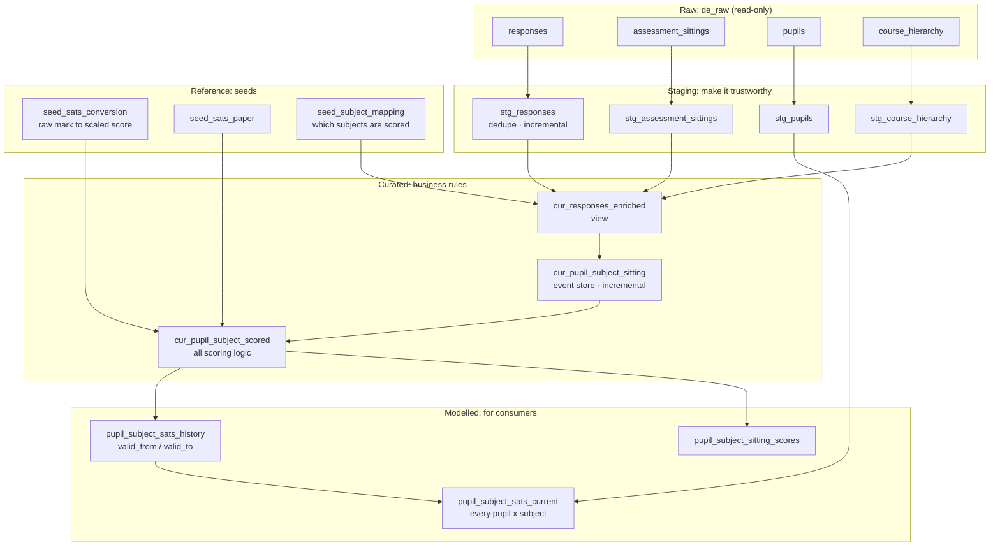
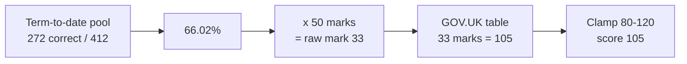

# Pupil SATs Scores

A dbt project that turns raw assessment activity in `atom-analytics-candidates.de_raw`
into a KS2 SATs score (80–120) per pupil, per subject.

**Status:** materialised in `atom-analytics-candidates.tomi_odumuyiwa`. All 101 data
tests pass, and a full build followed by an incremental build produce byte-identical
output (§8).

| For | Read |
|---|---|
| How a score is calculated, and open questions for Atom | [docs/SCORING.md](docs/SCORING.md) |
| Table grains, joins, the output contract | [docs/DATA_DICTIONARY.md](docs/DATA_DICTIONARY.md) |
| Every judgement call, numbered D1–D41 | [docs/DECISIONS.md](docs/DECISIONS.md) |
| Step 3: predicting GCSEs | [docs/GCSE_PREDICTION.md](docs/GCSE_PREDICTION.md) |
| How AI was used | [docs/ai/](docs/ai/) |

---

## 1. The idea

**Store the events, not the answer.** The pipeline records how many questions each
pupil attempted and got right *in each sitting*, and derives the score from the
sittings up to any date. Like a bank balance derived from transactions, this gives
three of the brief's requirements from one structure:

- **Re-runnable:** the score is a pure function of the stored events.
- **Point-in-time:** filter the events to a date and recompute.
- **Scalable:** the event table loads incrementally, one partition at a time.

The headline score pools **every question the pupil has answered in that subject so
far this term**. A single sitting is too noisy, and a lifetime average lags (§4).

---

## 2. The data

| Table | Rows | Grain |
|---|---|---|
| `responses` | 63,707 | One answer, with duplicates (§5) |
| `assessment_sittings` | 2,509 | One sitting |
| `pupils` | 242 | One pupil |
| `course_hierarchy` | 10,552 | One question |

- Activity runs 10/11/2025 to 16/09/2026. 164 of 242 pupils have responses.
- Every sitting covers exactly one subject.
- Seven subjects, but only **English** and **Maths** map to a SATs paper.

Profiling SQL is in [sql/profiling/](sql/profiling/), and the outputs behind every
figure are in [docs/ai/02_profiling_evidence.md](docs/ai/02_profiling_evidence.md).

---

## 3. Architecture



Each layer has one job:

- **Staging** fixes what the source gets wrong, such as duplicate events, without
  applying opinions.
- **Curated** applies business rules. Excluding Wellbeing is a business decision (the
  rows are true, they just aren't attainment), so it lives here, not in staging.
  All scoring logic sits in one file, `cur_pupil_subject_scored`.
- **Modelled** reshapes for consumers only.

`pupil_subject_sats_history` stores each score with the dates it was valid from and
to. "What was this pupil's score on 15/03/2026?" is a range lookup, not a
recomputation.

**Materialisation.** Only the models that grow with `responses` are incremental,
and only where a partition can be rebuilt without reading any other:

| Model | Materialised as | Why |
|---|---|---|
| `stg_responses` | Incremental, by `answered_date` | Deduplicates one day at a time; duplicate copies always share a day |
| `cur_responses_enriched` | View | Just a join. As a view, the date filter below reaches `stg_responses`' partitions, so no 100m-row rebuild |
| `cur_pupil_subject_sitting` | Incremental, by `sitting_date` | Rebuilds only sittings that *started* in the lookback window, so a partly-read sitting can never overwrite a partition |
| `cur_pupil_subject_scored` and modelled tables | Full rebuild | A term-to-date total spans partitions. Small: one row per sitting or less |

Incremental runs use `insert_overwrite` with a 7-day lookback, replacing partitions
whole, so a re-run gives the same table rather than a bigger one.

---

## 4. Scoring



No-attempts count as wrong, since a blank scores zero on a real paper. The
conversion tables are seeds keyed on year, so next year's tables are added as rows.
Full method: [docs/SCORING.md](docs/SCORING.md).

| Subject | Pupils | Scored? | Why |
|---|---|---|---|
| Maths | 152 | Yes | Direct KS2 equivalent |
| English | 154 | Yes, as reading | No topic names to split reading from GPS. The curves are within ~1 point |
| Screeners | 82 | No | A diagnostic, not attainment (15.7% no-attempt rate vs ~2% elsewhere) |
| Wellbeing | 129 | No | A survey, not an assessment |
| Verbal / Non-Verbal Reasoning | 8 / 3 | No | 11+ content, no KS2 equivalent |
| Science | 0 | No | No responses. KS2 science has no conversion table |

**Every pupil gets a row in every subject** (242 × 7) in `pupil_subject_sats_current`. Where there's no score, it's NULL with a `score_status` saying why: `not_applicable`, `excluded`, or `no_responses` for a pupil who hasn't sat that subject.

### Why the term?

| Window | Questions | Noise (1 SD) | Problem |
|---|---|---|---|
| Last sitting | ~25 | 3.47 points, measured | A pupil flat at 103 appears to swing 96–110 |
| **Term to date** | **29–87** | **~2.5** | **Resets at each term boundary (flagged)** |
| Lifetime | ~400 | ~1 | A Year 6 pupil still carries their Year 4 answers |

- The pool sums **questions**, not sitting percentages, so a 40-question sitting
  counts four times as much as a 10-question one.
- It is term-**to-date**, so the score on any past date is exactly what it was then.
- Each sitting also gets its own score in `pupil_subject_sitting_scores`, which is
  the trajectory a progress chart plots.
- Terms are approximated by calendar month (autumn Sep–Dec, spring Jan–Mar, summer
  Apr–Aug) because the data has no term dates.

### Results

| Subject | Scored | Mean | Range |
|---|---|---|---|
| English | 153 (+1 below the minimum mark) | 102.8 | 85–120 |
| Maths | 152 | 101.6 | 82–118 |

| Year group | 1 | 2 | 3 | 4 | 5 | 6 |
|---|---|---|---|---|---|---|
| Mean score | 101.8 | 102.2 | 100.7 | 100.5 | 102.6 | **104.7** |

This matches the shape predicted before the build: a narrow band just above 100,
with Year 6 higher. Maths is compressed in the middle (raw marks 56–94 all map to
100–110), which is a property of the national test.

One thing the run surfaced: the newest term had just started, so ~30 pupil-subjects
are scored on an average of 29 questions, against 56–87 elsewhere. `is_reliable`
(threshold 20) catches only one of them. That is the case to tune the threshold
against.

---

## 5. Data quality

| # | Issue | Scale | Decision |
|---|---|---|---|
| 1 | **Duplicate response events** with identical timestamps; 965 copies disagree on `is_correct` | 2,082 pairs, 2,411 surplus rows (3.8%) | Keep one per (session, question), lowest `response_id`. Arbitrary but deterministic and unbiased. Costs ~1.8pp on average for English and Maths (see below) |
| 2 | **Responses with no parent sitting**, apparently a hard delete that didn't cascade | 1,433 rows, 56 sessions, 44 pupils | Kept, flagged `sitting_known = FALSE`, year group taken from the pupil's nearest sitting |
| 3 | **Wellbeing is a survey**: `is_correct` records a chosen option | 3,936 rows | Excluded from scoring |
| 4 | Impossible year groups (11, 14, 15) | 25 sittings, 5 pupils | Excluded. No responses; looks like QA data |
| 5 | Sittings with no responses | 79 | Excluded, same cohort as #4 |
| 6 | `seconds_taken = 0` | 3,156 rows | Kept. 73% are no-attempts and the rest score at baseline: a timer that failed to record, not automated answers |
| 7 | `session_type` disagrees across tables | All rows | Not an error: a constant in each table, in two vocabularies. Dropped |
| 8 | `total_questions` wrong | 756 sittings | Not used; counts come from responses |
| 9 | Question bank content never answered | 672 questions | None needed. `course_hierarchy` is a catalogue |
| 10 | `is_deleted` never TRUE | 0 rows | Filters kept for production |

**What a duplicate looks like.** One question in session `00e4cfbf`, emitted twice:

| response_id | answered_at | seconds_taken | question_number | is_correct |
|---|---|---|---|---|
| `433b03a4…` | 2026-02-10 11:59:50 | 15 | 22 | FALSE |
| `6fb36a2d…` | 2026-02-10 11:59:50 | 15 | 22 | **TRUE** |

Same second, same duration, same position in the test, but opposite outcomes. A
genuine retry would have a later timestamp. The worst cases have five copies: in
session `094d339a`, question 12 appears five times at 11:43:30, and four copies say
FALSE while one says TRUE. The model keeps the copy with the lowest `response_id`
(FALSE in both examples).

**The cost of the duplicate rule**, measured as the gap between the most and least
generous resolution:

| Subject | Pupils affected | Mean gap | Worst |
|---|---|---|---|
| English | 141 / 154 | 1.8pp | 5.5pp |
| Maths | 136 / 152 | 1.8pp | 8.1pp |
| Verbal Reasoning | 5 / 8 | 15.8pp | 30.3pp |

Pupils with few responses are hit hardest, which is the evidence behind the
`is_reliable` flag.

---

## 6. Assumptions and limitations

| ID | Assumption | If wrong |
|---|---|---|
| A1 | Unattempted questions count as wrong | Scores rise, mostly for Screeners |
| A2 | Duplicates are logging artefacts, not retries | Quantified in §5 |
| A3 | English maps to the reading paper | ~1 scaled point |
| A4 | Pupils below Year 6 can be scored, read as "how they'd do on a SATs paper today" | Non-Y6 scores would need suppressing |
| A5 | Atom questions and the SATs paper are of comparable difficulty | **The weakest assumption.** Fixable with matched KS2 results |
| A6 | Point-in-time means event time, so deletions apply retroactively | Knowledge-time replay would need snapshots |
| A7 | Low-evidence scores are flagged, not hidden | — |

Limitations:

- **Difficulty isn't modelled.** Two pupils on the same percentage may have faced
  different questions. Fixing this needs IRT, which is out of scope.
- **Content appears calibrated to year group.** Percentage correct is flat across
  Years 1–5 (52–58%), then ~66% in Year 6, even on the Wellbeing survey. So a score
  measures performance against age-appropriate content, not absolute attainment.
- **Not a percentile.** A 105 means "would score 105 on the national test", not
  "better than 70% of pupils".

---

## 7. Not done, and next steps

**Known limitation:**

- **Conversion seed.** Rebuilt from published anchor points by
  [scripts/generate_conversion_seed.py](scripts/generate_conversion_seed.py). Exact
  at the anchors, within ~1 point between them. A full transcription is a ten-minute
  job.

**Next, in order of value:**

1. Split English into reading and GPS once topic names exist.
2. Weight by question difficulty.
3. Add a topic-coverage measure alongside each score.
4. Snapshot `pupils` for knowledge-time replay.
5. Add source freshness and volume monitoring, which would have caught the duplicate
   emissions.

---

## 8. Running it

```bash
cp profiles.yml.example ~/.dbt/profiles.yml   # set ATOM_DBT_DATASET; must be europe-west2
dbt deps
dbt build --vars '{single_dataset: true}'
```

By default each layer builds into its own dataset (`<dataset>_staging`, `_curated`,
`_modelled`, `_reference`). With `single_dataset: true`, everything builds into the
one dataset, which is how the submission is materialised in `tomi_odumuyiwa`.
Consumers only need the modelled tables.

| Var | Default | Effect |
|---|---|---|
| `conversion_year` | 2026 | Which GOV.UK table applies; stored on every row |
| `min_responses` | 20 | Threshold for `is_reliable`. Flags, never filters |
| `lookback_days` | 7 | Days reprocessed per incremental run |
| `partition_models` | true | Set false in a BigQuery sandbox (D36) |
| `single_dataset` | false | Build every layer into the one target dataset (D41) |

**Output:**

| Table | Rows |
|---|---|
| `stg_responses` | 61,296 (63,707 less 2,411 duplicates) |
| `cur_pupil_subject_sitting` / `_scored` | 2,486 |
| `pupil_subject_sats_history` | 1,365 |
| `pupil_subject_sats_current` | 1,694 (242 pupils × 7 subjects; 528 with evidence) |
| `pupil_subject_sitting_scores` | 2,486 |

### Re-runnability and the incremental path

Verified in `tomi_odumuyiwa`: a `--full-refresh` build, then a normal build that runs
the two incremental models as `insert_overwrite` merges. All six tables have
identical row counts and content checksums across the two runs:

```sql
select
    count(*) as row_count,
    -- NUMERIC: summing 61k INT64 fingerprints overflows
    sum(cast(farm_fingerprint(to_json_string(t)) as numeric)) as content_checksum
from `atom-analytics-candidates.tomi_odumuyiwa.pupil_subject_sats_history` t;
```

The incremental run also confirms partition pruning. `cur_pupil_subject_sitting`
processed 22 KiB, the last 7 days of `stg_responses`, because the date filter passes
through the `cur_responses_enriched` view.

No table has an `inserted_at` column, because a run timestamp would make two runs
differ by construction.

### Tests

101 data tests. Eight of them are custom, in [tests/](tests/), each guarding a failure
a spot check would miss:

| Test | Guards against |
|---|---|
| `assert_history_windows_are_contiguous` | Gaps or overlaps in validity windows, which would break point-in-time |
| `assert_one_current_row_per_pupil_subject` | Zero or two current rows |
| `assert_conversion_table_is_complete` | A truncated conversion seed |
| `assert_conversion_curve_is_monotonic` | A score *falling* after a good day |
| `assert_sitting_counts_reconcile` | Response and sitting grains disagreeing |
| `assert_term_pool_resets_each_term` | A term pool leaking across terms |
| `assert_no_events_lost_in_staging` | Silent row loss |
| `assert_every_pupil_has_every_subject` | A pupil or subject missing from the current scores |

The last was added after the sandbox's partition expiry silently cut 61,296 rows to
1,503, and **every other test still passed**. They check consistency, and a truncated
table is consistent with itself. This test reconciles the staged count against the
source.

---

## 9. AI usage

The work ran as two AI sessions with a deliberate handover. The first did design and
profiling and ended by writing [docs/ai/CONTEXT.md](docs/ai/CONTEXT.md) as a
standalone brief, and the second started from that file alone.

AI structured the profiling, pressure-tested interpretations and drafted docs. It
did not decide what the numbers mean. Two plausible readings of the data (that zero-second
answers were automated, and that the `session_type` mismatch was corruption) were ruled out by queries
written to test them. Where a call was genuinely arguable, such as the duplicate
tie-break, its cost was measured rather than argued.

Its most useful contribution was unrequested arithmetic. Regenerating the conversion
table exposed a seed documented as 234 rows that had 233, and a summary row that was
impossible. Both are now asserted in the generator script.
