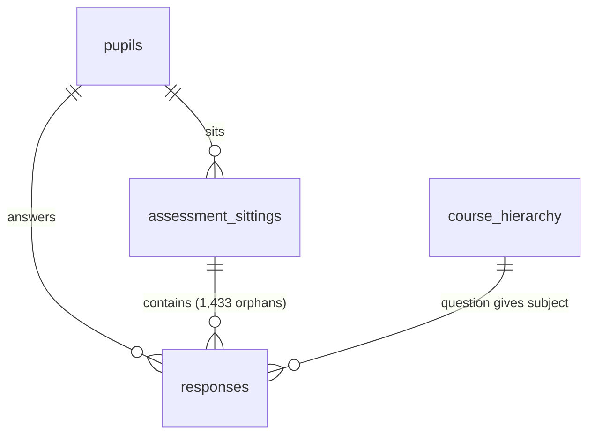

# Data dictionary

Source column meanings are in `models/staging/_src_de_raw.yml`, so `dbt docs
generate` shows them alongside the models. This file covers how the tables fit
together and the contract for the output tables.

---

## 1. Source tables



| Table | Rows | Grain | Key |
|---|---|---|---|
| `responses` | 63,707 | One answer event, duplicated. True grain is (session_id, question_id) | `response_id` (row-unique only) |
| `assessment_sittings` | 2,509 | One sitting | `session_id` |
| `pupils` | 242 | One pupil | `pupil_id` |
| `course_hierarchy` | 10,552 | One question | `question_id` |

- **Subject comes from the question, not the sitting.** Every sitting happens to be
  single-subject, but the model doesn't rely on that.
- **Integrity:** all joins are complete except `responses → assessment_sittings`,
  where 1,433 responses across 56 sessions have no sitting (D4).

**Fields not used:**

| Field | Why |
|---|---|
| `session_type` (both tables) | A constant in each: `MOCK_TEST` and `summative_assessment` |
| `assessment_sittings.total_questions` | Wrong for 756 sittings |
| `course_hierarchy.atom_id`, `subtopic_id` | Not needed at subject level. Kept in staging for topic-level work |

---

## 2. Reference seeds

| Seed | Rows | Contents |
|---|---|---|
| `seed_sats_conversion` | 233 | `paper`, `conversion_year`, `raw_mark`, `scaled_score` (NULL below 3 marks). Generated by `scripts/generate_conversion_seed.py` |
| `seed_sats_paper` | 3 | Per paper: `max_raw_mark`, `min_raw_mark_for_score`, and marks needed for 100 and 110 |
| `seed_subject_mapping` | 7 | Each Atom subject's `paper` and `scoring_method` (`sats_conversion`, `not_applicable`, `excluded`) |

---

## 3. Output: `pupil_subject_sats_history`

The table to migrate into the application database. **One row per pupil and subject
per change in score.** The score is the term-to-date pool.

**Natural key:** `(pupil_id, subject_id, valid_from)`.
**Suggested Postgres indexes:** a primary key on the natural key, plus `(pupil_id,
subject_id, valid_to)` for current-state lookups.

| Column | BigQuery | Postgres | Meaning |
|---|---|---|---|
| `pupil_id` | STRING | text | Pupil |
| `subject_id` | STRING | text | Subject |
| `subject_name` | STRING | text | Readable subject name |
| `valid_from` | DATE | date | First date this score applied (inclusive) |
| `valid_to` | DATE | date | Date it stopped applying (exclusive). NULL if current |
| `is_current` | BOOL | boolean | `valid_to` is NULL |
| `academic_year` | INT64 | integer | Starting year, e.g. 2025 for 2025/26 |
| `term_number_in_year` | INT64 | integer | 1 autumn, 2 spring, 3 summer |
| `term_name` | STRING | text | `autumn`, `spring`, `summer` |
| `term_label` | STRING | text | e.g. `Autumn 2025/26` |
| `number_of_sittings` | INT64 | integer | Sittings in the pool |
| `number_of_responses` | INT64 | integer | Deduplicated responses in the pool |
| `number_of_correct_responses` | INT64 | integer | Correct among them |
| `percentage_correct` | NUMERIC | numeric(5,2) | 0–100 |
| `paper` | STRING | text | SATs paper used. NULL if not scored |
| `conversion_year` | INT64 | integer | Which GOV.UK table was applied |
| `equivalent_raw_mark` | INT64 | integer | `round(pct × max_raw_mark)` |
| `sats_scaled_score` | INT64 | integer | 80–120. NULL if not scored |
| `meets_expected_standard` | BOOL | boolean | Score ≥ 100. NULL if not scored |
| `meets_higher_standard` | BOOL | boolean | Score ≥ 110. NULL if not scored |
| `is_reliable` | BOOL | boolean | Term responses ≥ `min_responses` (default 20) |
| `score_status` | STRING | text | Why a score is or isn't present (below) |
| `sitting_known` | BOOL | boolean | FALSE if the pool includes orphaned responses |
| `number_of_responses_all_time` | INT64 | integer | Lifetime responses, for context only |
| `year_group` | INT64 | integer | Year group at `valid_from`. Reporting only |
| `year_group_source` | STRING | text | `sitting`, `imputed_nearest` or `unknown` |

**How versions work:**
- A new row is created when the score, `score_status`, `is_reliable` or `paper`
  changes, not whenever more evidence arrives. Counts on a row describe the state at
  `valid_from`. For exact counts on any date, read `cur_pupil_subject_scored`.
- A term boundary almost always creates a new row, because the pool resets.
- There is no `inserted_at` column: a run timestamp would break re-runnability.

**`score_status` values:**

| Value | Meaning |
|---|---|
| `sats_conversion` | Scored |
| `below_minimum_raw_score` | Under 3 raw marks, so no score awarded |
| `not_applicable` | No KS2 equivalent (Screeners, VR, NVR, Science) |
| `excluded` | Not attainment (Wellbeing) |
| `no_responses` | The pupil has no activity in this subject. Current view only |
| `no_conversion_available` | No table row. Should never happen, and a test guards it |
| `unmapped_subject` | Subject missing from the mapping seed. Should never happen, and a test fails the build first |

**Point-in-time query** (half-open intervals, so boundary dates never double-count):

```sql
select *
from pupil_subject_sats_history
where valid_from <= @as_of
  and (valid_to is null or valid_to > @as_of)
```

---

## 4. Output: `pupil_subject_sats_current`

**Every pupil in every subject:** 242 × 7 = 1,694 rows, with the history table's
columns. What a dashboard reads by default.

- Where evidence exists, the row is the history table's current row.
- Where it doesn't, the score is NULL, `score_status = 'no_responses'`, counts are 0
  and `valid_from` is NULL. The history table only has rows once there's evidence.

---

## 5. Output: `pupil_subject_sitting_scores`

**One row per sitting:** the trajectory a progress chart plots.
**Natural key:** `(pupil_id, subject_id, session_id)`.

| Column | Meaning |
|---|---|
| `pupil_id`, `subject_id`, `subject_name`, `session_id` | Keys |
| `sitting_date` | The sitting's start date, or its first answer if the sitting row is missing |
| `academic_year`, `term_number_in_year`, `term_name`, `term_label` | Term |
| `number_of_responses`, `number_of_correct_responses`, `percentage_correct` | This sitting only |
| `equivalent_raw_mark`, `sats_scaled_score` | This sitting's own score |
| `term_sats_scaled_score`, `number_of_responses_in_term` | The headline term score immediately after this sitting |
| `paper`, `conversion_year`, `score_status`, `is_reliable`, `sitting_known`, `year_group`, `year_group_source` | As in the history table |

**Read the line, not the points.** One sitting is ~25 questions, so its score varies
by about ±3 points from noise alone.
