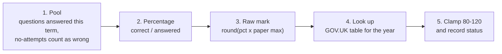

# Scoring method

How responses become a score from 80 to 120, what that score means, and what Atom
could tell us to make it better. D-numbers refer to [DECISIONS.md](DECISIONS.md).
The conversion tables are sourced in
[ai/03_scoring_research.md](ai/03_scoring_research.md).

---

## 1. Method

All scoring logic is in `models/curated/cur_pupil_subject_scored.sql`.

**Worked example.** A Year 6 pupil has 412 English responses this term, 272 of them
correct.

| Step | Value |
|---|---|
| Percentage | 272 / 412 = 66.02% |
| Raw mark | round(0.6602 × 50) = 33, on the 50-mark reading paper |
| Scaled score | 33 marks → **105** |
| Expected standard (≥ 100) | Met |
| Higher standard (≥ 110) | Not met |

**Step 3 is the assumption that matters.** The other steps are arithmetic. Step 3
claims that Atom's questions and the SATs paper are of comparable difficulty, so a
percentage on one transfers to the other. If that's wrong, every score shifts. It
can be tested (question 1 in §5).

---

## 2. Subject mapping

KS2 has papers for reading, maths, and grammar, punctuation and spelling (GPS). The
mapping is held as data in `seeds/seed_subject_mapping.csv`, so someone who doesn't
read SQL can review it.

| Subject | Paper | Method | Why |
|---|---|---|---|
| Maths | maths | `sats_conversion` | Direct equivalent |
| English | reading | `sats_conversion` | See below |
| Screeners | — | `not_applicable` | A diagnostic. The 15.7% no-attempt rate suggests a timed test pupils aren't expected to finish |
| Wellbeing | — | `excluded` | A survey. `is_correct` records a chosen option |
| Verbal / Non-Verbal Reasoning | — | `not_applicable` | 11+ content, no KS2 equivalent |
| Science | — | `not_applicable` | No responses. KS2 science is teacher-assessed, so there's no conversion table |

Every pupil gets a row in every subject. Where there's no score, it's NULL with a
`score_status` explaining why, including `no_responses` for subjects a pupil hasn't sat.

**English.** KS2 English has two papers, reading and GPS, with separate tables.
`course_hierarchy` has no topic names, so the questions can't be split. But the two
curves are within one scaled point everywhere:

| Atom % | 30 | 50 | 58 | 70 | 85 | 95 |
|---|---|---|---|---|---|---|
| Reading | 93 | 100 | 103 | 107 | 113 | 120 |
| GPS | 94 | 100 | 103 | 107 | 114 | 120 |

So mapping English to reading costs about a point. Once topic names exist, the fix is
one seed row plus a split on `topic_id`.

---

## 3. Conversion tables

Source: *2026 key stage 2 scaled score conversion tables*, Standards and Testing
Agency, GOV.UK, 16/07/2026. Open Government Licence v3.0.

| Paper | Max marks | Marks for 100 | Marks for 110 |
|---|---|---|---|
| Reading | 50 | 25 | 39 |
| GPS | 70 | 34 | 55 |
| Maths | 110 | 56 | 94 |

Published rules in the seeds:
- 100 is the expected standard and 110 the higher standard.
- 80 is the lowest score and 120 the highest.
- **Fewer than 3 raw marks gets no score.** The status is then
  `below_minimum_raw_score`.

What typical percentages produce:

| Atom % | 30 | 40 | 50 | 58 | 66 | 75 | 85 | 95 |
|---|---|---|---|---|---|---|---|---|
| Reading | 93 | 97 | 100 | 103 | 105 | 109 | 113 | 120 |
| Maths | 94 | 97 | 99 | 101 | 103 | 106 | 110 | 115 |

The cohort averages ~58% (Year 6 ~66%), so expect most pupils at 101–103 and Year 6
at 103–105.

The tables are keyed on `conversion_year`, so a new year is added as rows, and the
year used is stored on every output row.

> **The seed is reconstructed, not transcribed.** GOV.UK publishes the tables as a web
> page. `scripts/generate_conversion_seed.py` rebuilds the full curve from anchor
> points noted during research: it is exact at every published anchor and within
> about a point between them. Replace the anchors with a full transcription before
> relying on this. The script's assertions and the two seed tests will still apply.

---

## 4. What the score doesn't mean

- **Difficulty isn't modelled.** Two pupils on the same percentage may have faced
  easier or harder questions. Fixing this needs a Rasch or IRT model (out of scope).
- **It may be relative to year group.** Percentage correct is flat across Years 1–5,
  then jumps in Year 6, in every subject, including the Wellbeing survey:

  | Subject | Y1 | Y2 | Y3 | Y4 | Y5 | Y6 |
  |---|---|---|---|---|---|---|
  | English | 56.3 | 56.2 | 57.5 | 52.2 | 56.9 | 66.5 |
  | Maths | 56.1 | 53.4 | 58.8 | 54.9 | 57.3 | 66.4 |
  | Wellbeing | 59.0 | 56.3 | 67.5 | 58.3 | 59.5 | 66.1 |

  This suggests content is pitched at each year group. If so, a Year 3 score and a
  Year 6 score measure different things. `year_group` is on every row so consumers
  can account for it.
- **It isn't a percentile.** A 105 means "would score 105 on the national test", not
  "better than 70% of pupils". Cohort percentiles were rejected: 164 pupils isn't a
  national sample, and each pupil's score would shift whenever another pupil joined.
- **Topic coverage isn't balanced.** Heavy practice on one topic can overstate a
  pupil's breadth.

---

## 5. Open questions for Atom

Ordered by how much the answer would change the output.

1. **Do any pupils have both Atom history and real KS2 results?** Even a few dozen
   would replace the difficulty assumption with a measured calibration. They would
   also be the foundation for GCSE prediction.
2. **Should non-Year-6 pupils share the scale?** A Year 3 pupil on 56% scores ~100,
   which reads as "meeting the Year 6 standard". Options: keep it as it is with
   year group shown, suppress non-Y6 scores, or build per-year bands. This is a
   product decision.
3. **Is the term the right window?** Changing it is one line (`term_window` in
   `cur_pupil_subject_scored.sql`).
4. **Which duplicate copy is authoritative?** The model takes the lowest
   `response_id`. If the source system has a rule, use it.
5. **Which year's tables for a historical score?** Currently the latest (2026)
   everywhere. Using the tables in force at the time is also valid, but breaks
   history at each July. Both are reproducible from the stored `conversion_year`.
6. **Should Screeners get a score on another scale?**
7. **How much evidence should be required before a score is shown?** `min_responses =
   20` is a placeholder, and it only sets a flag. If product wants low-evidence scores
   hidden, the threshold starts to matter.
8. **Are real term dates available?** Terms are approximated by calendar month, and
   Easter moves. Since the score resets at each term boundary, getting this right
   matters. Real dates would become a seed read by `macros/academic_calendar.sql`.
9. **Were the missing sittings deleted deliberately?** If so, their 1,433 responses
   should be removed too, not flagged.

---

## 6. Where to change what

| To change | Edit |
|---|---|
| Which subjects are scored, against which paper | `seeds/seed_subject_mapping.csv` |
| Conversion tables, or add a year | `scripts/generate_conversion_seed.py`, then `dbt seed` |
| Which year applies | `vars.conversion_year` |
| Reliability threshold | `vars.min_responses` |
| Scoring window | `term_window` in `cur_pupil_subject_scored.sql` |
| Term dates | `macros/academic_calendar.sql` |
| How a percentage becomes a score | `cur_pupil_subject_scored.sql` only |
| What counts as a new history version | `version_key` in `pupil_subject_sats_history.sql` |
